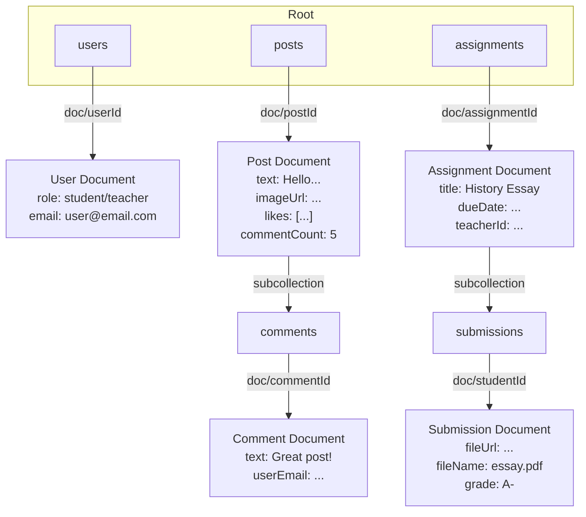
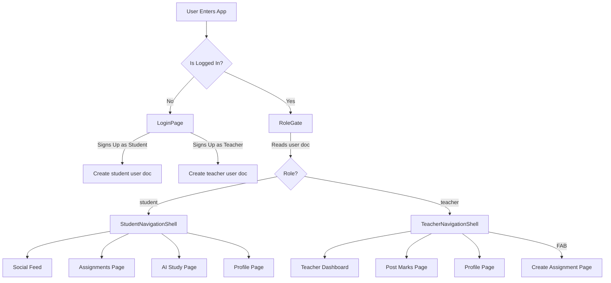

# 📸 Classroom Instagram

**A Smart Academic Engagement Platform. Combining the best of social media with the structure of a classroom.**

This project was built for the **JBIET HackX 2025** hackathon.

---

## 🚀 Live Demo

* **Live Web App:** (https://classroom-instagram-app.web.app/)

---

## 🎯 The Problem

Traditional classroom management tools (like Google Classroom) are formal, rigid, and non-engaging. Students rarely interact beyond submitting assignments, leading to low motivation. Meanwhile, students are highly active on social media platforms, which foster creativity, peer interaction, and instant updates.

## ✨ Our Solution

"Classroom Instagram" is an AI-powered academic social platform that works like Instagram for the classroom. It's visual, interactive, and engaging.

* Teachers can post academic notices, assignments, marks, and attendance.
* Students can interact with posts, submit work, and view their grades.
* A built-in AI assistant helps students study by generating flashcards from notes.

## 🏆 Key Features

### 1. Role-Based Authentication & Dashboards

The app provides a completely different, tailored UI depending on the user's role. This is established during the **Sign Up** process, where a user must identify as either a Student or a Teacher. This role is then saved to Firestore and controls the entire app experience.

| **Sign Up (with Role Selection)** | **Student Dashboard** | **Teacher Dashboard** |
| :---: | :---: | :---: |
| The beautiful login screen includes a toggle that appears during sign-up, allowing users to select their role. | Students get a 4-tab view focused on consuming content, viewing work, and using the AI study tool. | Teachers get a 3-tab view with a center "Create" button, focused on posting assignments and managing grades. |
|  |  |  |

### 2. The Social Feed (Posts, Likes & Comments)

A real-time, Instagram-style feed where teachers and students can post updates.

* **Full-Width Image Posts:** Images are displayed in their full aspect ratio, just like a modern social app.
* **Real-time Likes:** Tap the heart, and the count updates instantly for everyone, powered by Firestore.
* **Real-time Comments:** A full comment section for each post.

| **Main Feed** | **Comments Page** |
| :---: | :---: |
|  |    |

### 3. "Wow" Feature: AI Study Buddy

An integrated AI tool to help students study. Using the **Google Gemini API**, students can paste in their lecture notes and instantly receive a set of Q&A flashcards.

| **Input Notes** | **Generated Flashcards** |
| :---: | :---: |
|  |  |

### 4. The Complete Academic Loop (End-to-End)

This is the core of the platform. We built the *entire* feedback loop for assignments.

#### 1. Teacher Posts Assignment
Teachers get a dedicated "Create Assignment" form with title, description, and a due date picker.

#### 2. Student Views Assignment
Students see all assignments in their "Work" tab, sorted by due date. 

#### 3. Student Submits Work
Students can upload their work (PDF, images, etc.) and add a private comment for the teacher. 

#### 4. Teacher Views Submissions
The teacher's dashboard lists all student submissions for each assignment. They can view the file and see the student's comments. 

#### 5. Teacher Posts Grade
The teacher can post a mark (e.g., "A+" or "95/100") directly from the submissions page.

#### 6. Student Views Grade
The student can go to their "My Marks" page to see all their grades in one place.

## Tinker
 🛠️ Technology Stack

| Category | Technology |
| :--- | :--- |
| **Frontend** | Flutter (cross-platform for Web, iOS, & Android) |
| **Backend** | Firebase (Authentication, Firestore, Storage) |
| **AI** | Google AI Studio (Gemini API) |
| **Key Packages** | `firebase_core`, `cloud_firestore`, `firebase_storage`, `file_picker`, `image_picker`, `google_generative_ai`, `intl`, `timeago` |

---

# 🏛️ Project Architecture & Database Schema

This document outlines the high-level architecture and database structure for the Classroom Instagram app.

## 1. System Architecture

The app uses a **Flutter frontend** with a **Firebase backend**. This is a classic "serverless" model that allows for rapid development, real-time data, and high scalability.

* **Flutter:** Handles all UI and business logic.
* **Firebase Authentication:** Manages user sign-up, login, and identity.
* **Cloud Firestore:** Acts as our main NoSQL database for all app data.
* **Firebase Storage:** Used to host and serve user-uploaded images and files (like assignment submissions).
* **Google Gemini API:** Provides AI-powered features like the flashcard generator.

## 2. Cloud Firestore Schema

This diagram shows how our data collections are organized in Firestore.

---

## 🔄 System Workflow

We use Firebase for robust authentication and a role-based system to direct users to the correct experience. When a user logs in, the app checks their "role" in Firestore (`student` or `teacher`) and provides the correct navigation shell for their tasks.

---

## 🔮 Future Roadmap

Given more time, we would love to expand the platform's features:

* **Attendance Module:** A "check-in" button for students that allows teachers to take attendance in real-time.
* **AI-Powered Moderation:** Use an AI model to automatically flag inappropriate language in posts or comments.
* **Direct Messaging:** A chat system for student-to-student and student-to-teacher communication.
* **Push Notifications:** Send real-time push notifications for new grades, assignments, and comments.
* **Calendar Integration:** A full calendar view that automatically populates with assignment due dates.
